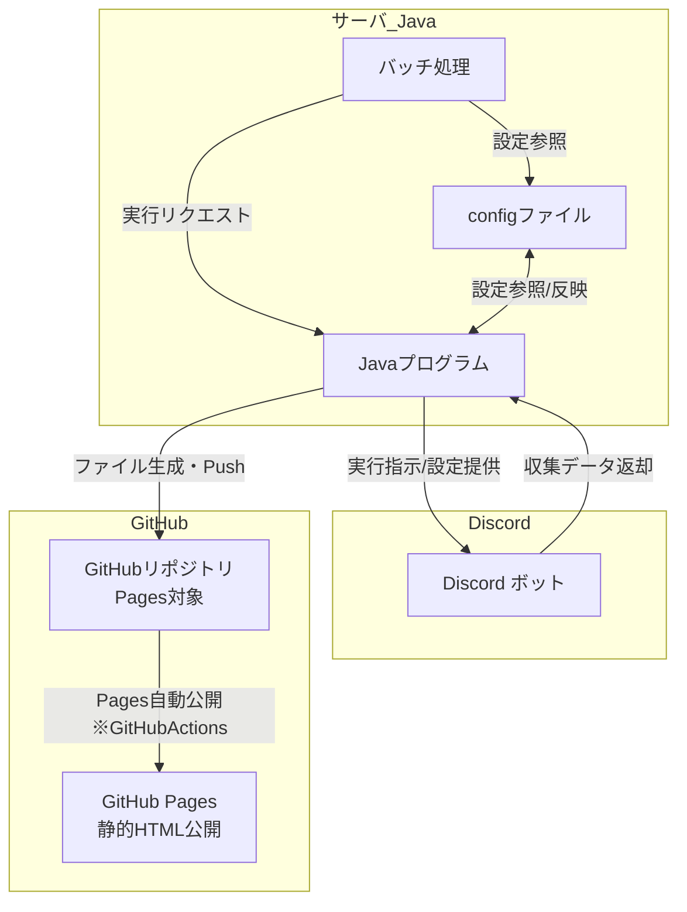

# 機能間データフロー

1. バッチ処理がJavaプログラムに対して実行リクエストを送る。
2. Javaプログラムは、必要に応じてDiscordボットへ実行指示や設定情報を提供する。
3. Discordボットがデータ収集などを行い、その結果をJavaプログラムへ返却する。
4. Javaプログラムはconfigファイルを参照・反映しながら各種処理を動作させる。
5. Javaプログラムは取得・処理したデータをファイルとして生成し、GitHubリポジトリへpushする。
6. GitHubリポジトリは、pushされたファイルを元にGitHub Actionsを用いてPagesを自動公開する。
7. GitHub Pagesは公開された静的HTMLとしてWebで情報提供を行う。
